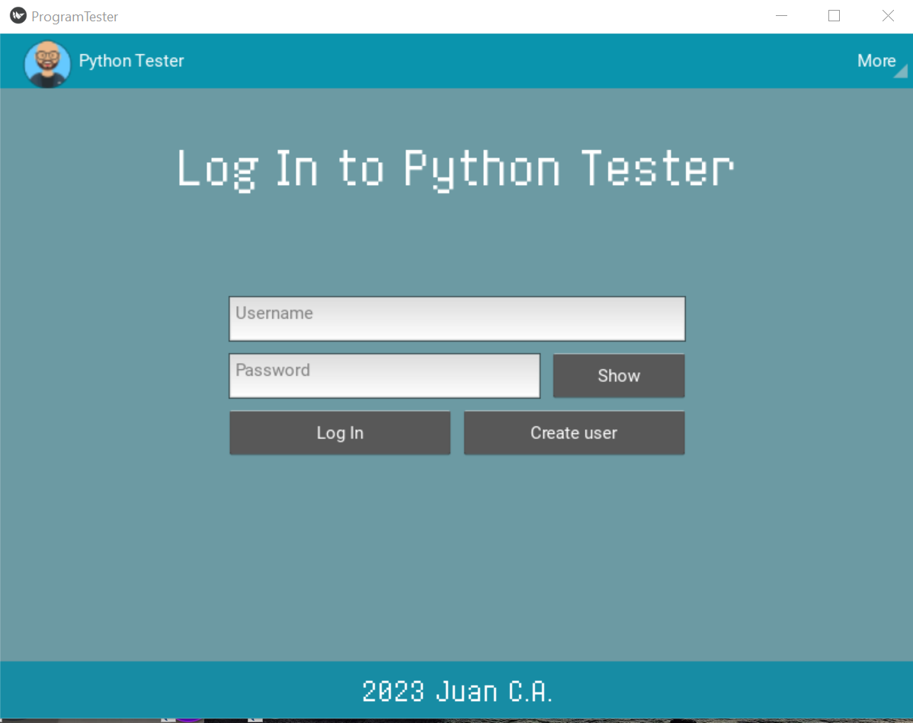
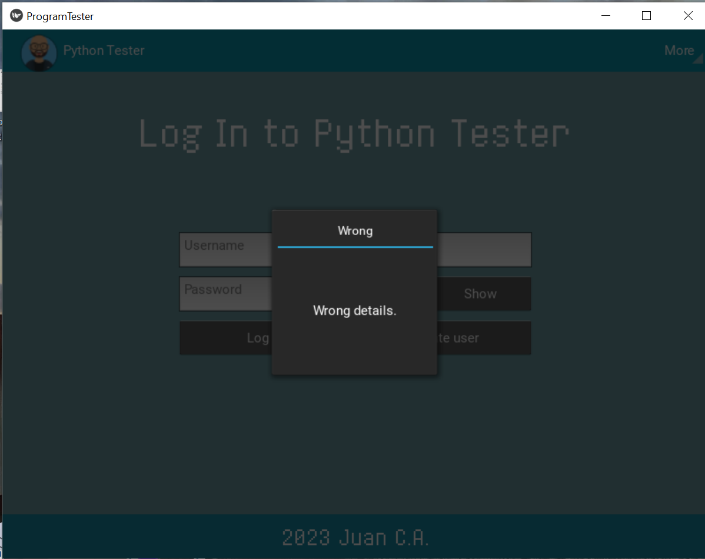
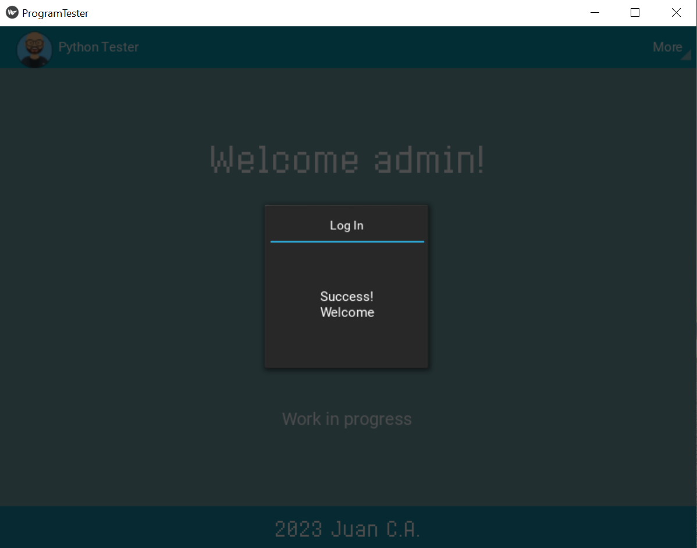
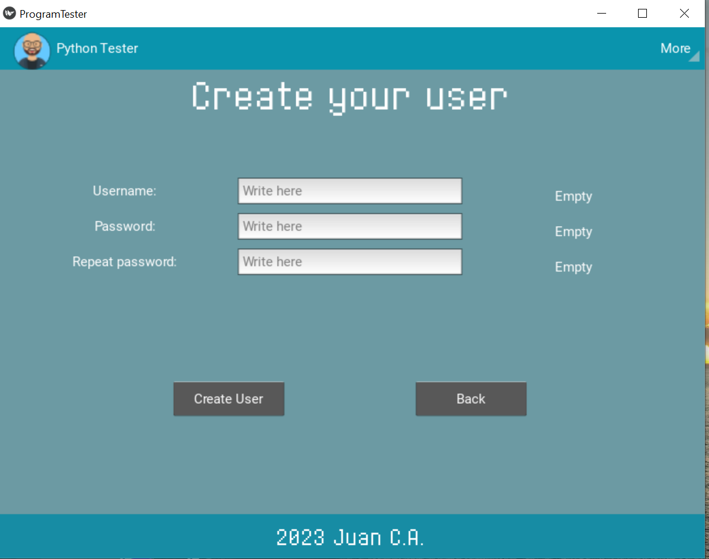
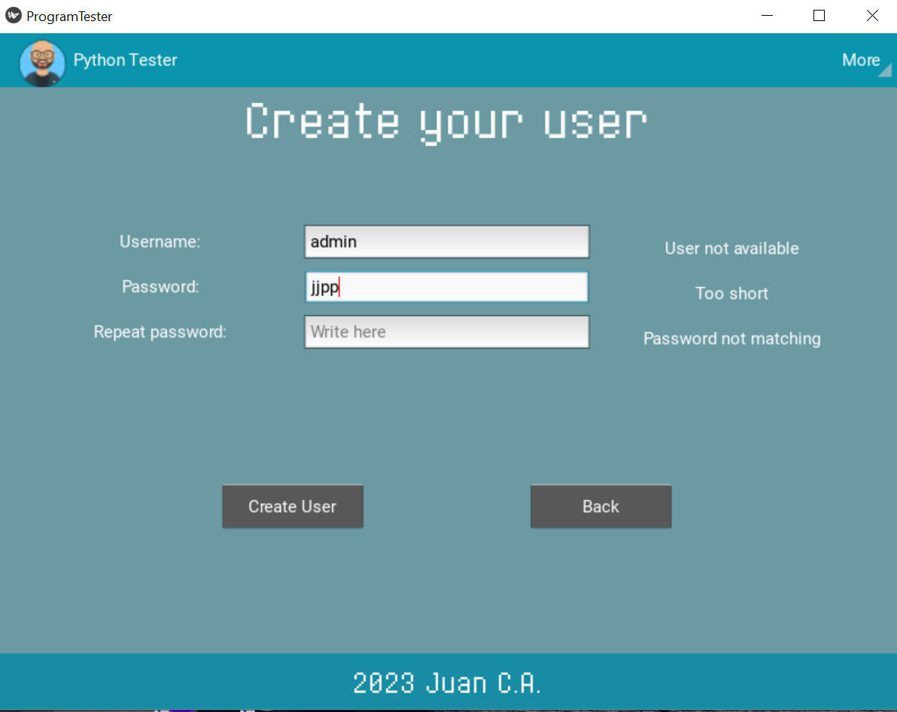

# PythonTester App
Note this app is a work in progress. And will include improvements and functionality in the future.

## Instructions
- Create a Fork of the repository (you can access all projects).
- Open your favourite IDE (I use [PyCharm](https://www.jetbrains.com/pycharm/)).
- Check the ***[requirements.txt](https://github.com/JuanCarcedo/jca-python-projects/blob/main/requirements.txt)*** file.  
  - For this project you will need:
    + Kivy required (2.1.0).
    + [SQLite Studio](https://www.sqlitestudio.pl/) to check the DataBase content.

Note:  
- User data is stored in the  ```data/appdata.db```.
- Images are stored in ```data/background/```.
- Fonts are stored in ```data/fonts/```.

## How to use
Run the file ```main.py```.  
The interface should be easy to navigate.  
Actual capabilities of the app:  
- Log In: Log into the system.
- Create new user: Generate a new user in the system.

Passwords and user creation/login has multiple security checks. Feel free to try them all.

## Example of output
Log in screen:


Wrong details:


Log in correct:  


Create new user:  


Checks in create new user:


## Author and Licence
**[Juan Carcedo](https://github.com/JuanCarcedo)**  
2022 Copyright © - Licence [MIT](https://github.com/JuanCarcedo/jca-python-projects/blob/main/LICENSE.txt)